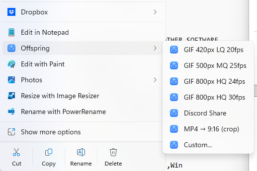
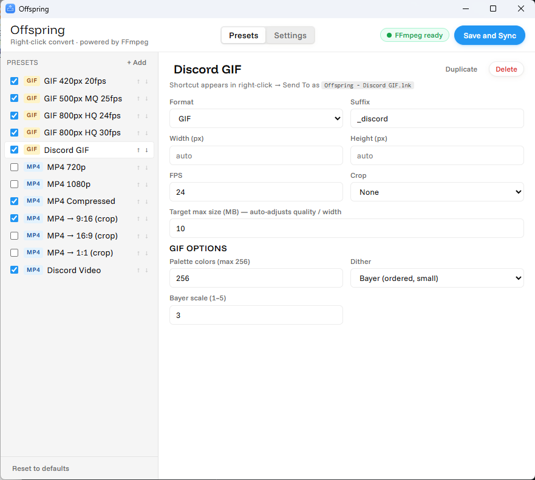
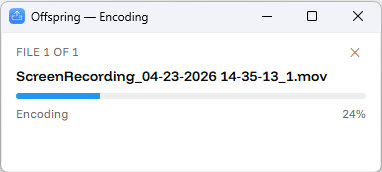

# Offspring

**Right-click convert videos & images with FFmpeg — from anywhere in Windows.**

---

Offspring is a tiny Windows 11 app that adds video/image conversion shortcuts
to your right-click menu. Drop a `.mov` on a shortcut, get a trimmed-down
`.mp4` or a Discord-ready `.gif` in the same folder. No windows to open, no
command lines, no upload to a web service.

  

## What it does

- Ships a **classic right-click submenu** on every video and image
  (always on) — one click per preset.
- Optionally populates your **Send to** menu.
- Optionally integrates with the **Windows 11 modern right-click menu**
  (top-level, no "Show more options") via a signed sparse MSIX package.
- Manages a curated list of presets — GIFs for Discord, compressed MP4s,
  cropped 9:16 verticals, 1080p downscales — that you can freely edit,
  reorder, and add to from the Presets tab. Every preset can set its
  own crop, max file size, palette, and dither for GIFs.
- Streams per-file progress in a small always-on-top window while
  FFmpeg does the work.

  

  

## Install

Grab the latest `Offspring-Setup-<version>.exe` from the
[Releases page](https://github.com/honear/offspring/releases/latest) and run
it. The installer is admin-only — that keeps every install in the same scope
(no stacked per-user + machine copies) and lets it trust the shell-extension
signing cert so the modern Windows 11 menu toggle works without prompts.

On first install, Offspring offers to download the LGPL essentials FFmpeg
build (~80 MB) into `%LOCALAPPDATA%\Offspring\ffmpeg\`. You can also point
the app at a pre-existing FFmpeg install from the Settings tab.

Updates: once installed, Offspring checks GitHub Releases on launch,
downloads a new installer in the background, and offers a one-click
"Restart and install" when it's ready. Every installer is signed
offline with an Ed25519 [minisign](https://jedisct1.github.io/minisign/)
key whose public counterpart is pinned in the binary; the in-app
updater verifies the signature against that key and refuses to
launch any installer whose signature is missing or doesn't match.
See [SECURITY.md](./SECURITY.md) and [THREAT_MODEL.md](./THREAT_MODEL.md)
for the full picture.

## FFmpeg licensing

Offspring does **not** bundle FFmpeg. It invokes whatever FFmpeg lives in
`%LOCALAPPDATA%\Offspring\ffmpeg\` (downloaded on demand) or the path you
configured in Settings. FFmpeg is © the FFmpeg developers, licensed under
the [LGPL v2.1+](https://www.ffmpeg.org/legal.html), and its source is
available at <https://ffmpeg.org/download.html>.

Because Offspring calls FFmpeg as a separate executable (no linking), the
LGPL does not propagate to Offspring's own code. Offspring itself is MIT.

Full third-party attributions live in [NOTICE.md](./NOTICE.md).

## Privacy

Offspring makes no analytics, telemetry, or phone-home calls. The only
outbound network traffic is the GitHub Releases update check, the
gyan.dev FFmpeg download (one-time, user-triggered), and the
user-triggered installer download. Full inventory in
[SECURITY.md → Privacy / network connections](./SECURITY.md#privacy--network-connections).

## License

[MIT](./LICENSE) © 2026 Second March.
